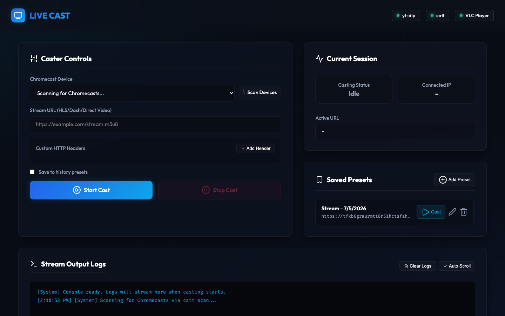

# Live Cast

A premium, glassmorphic dark-mode web application to discover local Chromecast, AirPlay, and DLNA devices and cast streaming media URLs (e.g. HLS feeds, Dash feeds, direct video links) using a local macOS process pipeline combining `yt-dlp`, `VLC`, `pyatv`, and DLNA UPnP.



---

## Features
- **Multi-Protocol Device Discovery**: Scan your local network for **Chromecast** (via `catt`), **AirPlay** receivers (via `atvremote`), and **DLNA/UPnP** smart TVs — all in a single scan.
- **Smart Cast Routing**: Automatically detects DLNA-capable TVs and casts via UPnP SOAP. Falls back to AirPlay for Apple TV and other receivers.
- **Header Customization**: Add key-value HTTP headers (like custom `Referer` or `User-Agent`) to bypass geo-blocks or referer checks on stream feeds.
- **Secure Header Handling**: Custom headers are stored server-side with single-use tokens — never exposed in URLs or logs.
- **Local Stream Proxy**: A built-in Express proxy pipes `yt-dlp` output directly to your cast device, ensuring custom headers are respected even on protocols that don't natively support them.
- **Local Player Preview**: HLS streams are previewed in-browser using hls.js, with an AirPlay fallback tip for direct browser-to-TV casting.
- **Stream Logs Console**: Polls and outputs live `stdout` and `stderr` logs from all spawned processes directly in an interactive on-screen terminal.
- **Preset Management (CRUD)**: Save your favorite streams as presets with custom headers. Play, edit, or delete them instantly from the sidebar.
- **Responsive Premium UI**: Visually stunning obsidian dark dashboard built with pure CSS glassmorphism, smooth animations, and complete WCAG-compliant keyboard accessibility.
- **Zombie Process Protection**: Automatic process hooks ensure background streaming child processes (yt-dlp, VLC, atvremote, proxy streams) are killed gracefully when you stop streaming or close the server.

---

## Tech Stack
- **Backend**: Node.js, Express, CORS
- **Frontend**: HTML5, CSS3 (Custom Grid/Flex layout), Vanilla JavaScript (ES6 Modules), hls.js
- **Utilities**:
  - `yt-dlp` — Stream resolver and proxy
  - `catt` — Chromecast device discovery and casting
  - `pyatv` / `atvremote` — AirPlay device discovery and remote control
  - VLC Player — Chromecast streaming pipeline
  - DLNA UPnP — Native smart TV casting via SOAP

---

## Prerequisites

This application is designed to run locally on **macOS** and requires the following utilities installed and available on your system path:

1. **VLC Player**: Must be installed in your `/Applications` directory (executable at `/Applications/VLC.app/Contents/MacOS/VLC`).
2. **yt-dlp**: Used to fetch and proxy streams.
   ```bash
   brew install yt-dlp
   ```
3. **catt**: Used to scan and cast to Chromecast devices.
   ```bash
   pip3 install catt
   ```
4. **pyatv**: Used to scan and cast to AirPlay/Apple TV devices.
   ```bash
   pip3 install pyatv
   ```

---

## Getting Started

1. Clone or navigate to the project directory:
   ```bash
   cd live_cast
   ```

2. Install the server dependencies:
   ```bash
   npm install
   ```

3. Start the application:
   ```bash
   npm start
   ```

4. Open your browser and navigate to:
   ```
   http://localhost:3000
   ```

---

## Usage Guide

1. **Verify Setup**: On load, check the top-right toolbar. The status dots next to `yt-dlp`, `catt`, `pyatv`, and `VLC Player` will turn **green** if they are detected on your Mac.
2. **Scan**: Click **Scan Devices** to fetch Chromecasts, AirPlay receivers, and DLNA TVs on your network. Devices are labeled by type — `[Chromecast]` or `[AirPlay]`. Select your target device from the dropdown.
3. **Input Stream**: Paste your stream URL (e.g. HLS `.m3u8` feed).
4. **Add Headers (Optional)**: If the stream requires a custom referer or client headers, click **Add Header** to include key-value pairs (e.g. Key: `Referer`, Value: `https://mycustomorigin.com`). Headers are transmitted securely via server-side tokens.
5. **Cast**: Click **Start Cast**. The app routes to the best protocol automatically:
   - **Chromecast** → yt-dlp → VLC pipeline
   - **DLNA Smart TV** → UPnP SOAP commands
   - **AirPlay / Apple TV** → pyatv with local stream proxy
   - A **Local Player Preview** card also appears showing the proxied stream in your browser.
6. **Stop**: Click **Stop Cast** to immediately disconnect and stop all child processes (VLC, yt-dlp, proxy streams, and send stop commands to the TV).
7. **Save Presets**: Check the **Save to history presets** option before casting, or click **Add Preset** in the sidebar to manually save stream configurations.

### AirPlay Pairing

Some Apple TV / AirPlay receivers require one-time pairing before casting:

```bash
atvremote --id "<device-id>" --protocol airplay pair
```

Enter the passcode shown on your TV screen. The device ID is visible in the scan logs. After pairing, casting will work without authentication prompts.

### Firewall Note

The local stream proxy runs on port 3000. If your Mac firewall is enabled, ensure incoming connections on port 3000 are allowed so your Apple TV or smart TV can reach the proxy stream.

---

## Project Structure

```
live_cast/
├── data/
│   └── history.json          # Presets JSON database
├── public/
│   ├── css/
│   │   └── style.css         # Core styles & layout (Obsidian design tokens)
│   ├── js/
│   │   └── app.js            # Frontend controller, API requests & toaster
│   └── index.html            # Main dashboard HTML template
├── services/
│   ├── castManager.js        # Casting lifecycle manager (Chromecast, AirPlay, DLNA)
│   ├── historyStore.js       # Local presets storage engine
│   ├── networkUtils.js       # Network helpers (local IP address resolution)
│   └── playAirplay.py        # Python AirPlay playback & control service (pyatv)
├── package.json              # Node project manifest
├── README.md                 # Documentation
├── server.js                 # Express API router & process life cycle coordinator
├── spec.md                   # Technical specification
└── plan.md                   # Development phases checklist
```
