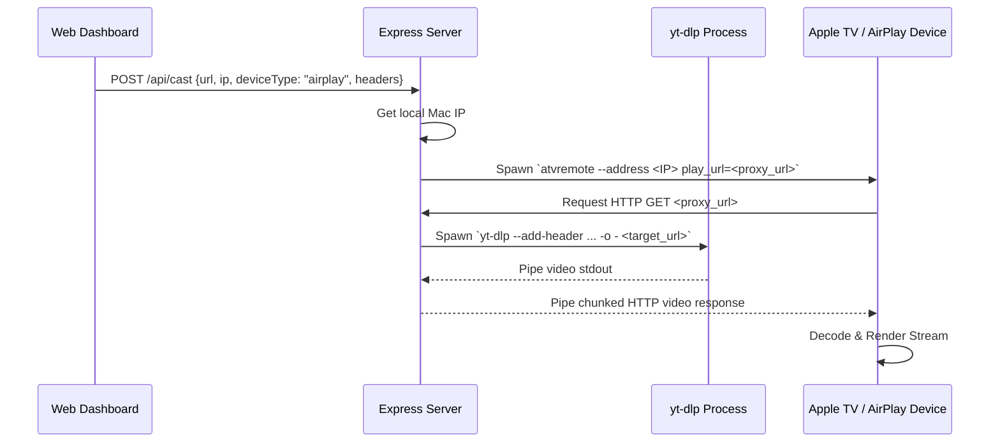

# Spec: AirPlay Support for Live Cast

## Objective
Enable users of the Live Cast macOS web application to discover AirPlay-compatible receivers (like Apple TV) on their local network and cast video streams (including HLS/Dash and direct video files) with custom HTTP headers.

### User Stories
- As a user, I want to see both Chromecasts and AirPlay devices in the device dropdown.
- As a user, I want to cast media streams to my Apple TV / AirPlay receiver.
- As a user, I want the custom HTTP headers (Referer, User-Agent, etc.) to be respected by the stream on the AirPlay receiver.
- As a user, I want to see live logs and status updates for my AirPlay casting sessions just like Chromecasts.

---

## Tech Stack
- **Backend**: Node.js, Express, CORS
- **Frontend**: HTML5, CSS3, Vanilla JavaScript (ES6 Modules)
- **Utilities**:
  - `yt-dlp` (Stream resolver)
  - `catt` (Cast All The Things - Chromecast discovery/casting)
  - `VLC Player` (Local desktop client/transcoder)
  - `pyatv` / `atvremote` (Apple TV / AirPlay discovery and remote control)

---

## Technical Architecture

### 1. AirPlay Protocol Limitations & Mitigation
Unlike Chromecast (which VLC streams to using raw media streams via `--sout=#chromecast`), AirPlay is a proprietary protocol that does not accept custom HTTP headers in its direct casting payload.
To bypass this limitation, we will implement a **Local Express Stream Proxy**:
1. When casting to AirPlay, the backend generates a local streaming URL: `http://<mac-ip>:<port>/api/stream?url=<encoded-target-url>&headers=<encoded-headers>`
2. We command the AirPlay device to play this local proxy URL using `atvremote`:
   ```bash
   atvremote --address <device-ip> play_url=<local-proxy-url>
   ```
3. When the AirPlay device requests the proxy URL, the Express backend spawns `yt-dlp` with the requested target URL and custom headers, and pipes its `stdout` directly into the HTTP response stream.



---

## Commands
```bash
# Start server
npm start

# Dev mode (live reloading)
npm run dev

# Discover AirPlay devices manually
atvremote scan

# Play stream manually on Apple TV
atvremote --address <apple-tv-ip> play_url="http://<mac-ip>:3000/api/stream?url=<encoded-url>"
```

---

## Project Structure
```
live_cast/
├── data/
│   └── history.json       # Presets JSON database
├── public/
│   ├── css/
│   │   └── style.css      # Custom dashboard CSS style definitions
│   ├── js/
│   │   └── app.js         # Web client & state controller
│   └── index.html         # Main dashboard HTML template
├── services/
│   ├── castManager.js     # Manages process spawn pipelines (VLC / atvremote / yt-dlp)
│   ├── historyStore.js    # Local presets storage engine
│   └── networkUtils.js    # Network helpers (local IP address resolution)
├── package.json           # Node project manifest
├── README.md              # Documentation
├── server.js              # Express API router & process life cycle coordinator
└── spec.md                # This specification
```

---

## Code Style
- **Modules**: Standard CommonJS (`require`) on Node backend, ES6 Modules (`import`/`export`) on frontend.
- **Variables**: Prefer `const` and `let` over `var`.
- **IP Detection**: Standard `os.networkInterfaces()` parsing to retrieve correct IPv4.

Example local IP detection logic in `services/networkUtils.js`:
```javascript
const os = require('os');

function getLocalIPv4() {
  const interfaces = os.networkInterfaces();
  for (const name of Object.keys(interfaces)) {
    for (const iface of interfaces[name]) {
      if (iface.family === 'IPv4' && !iface.internal) {
        return iface.address;
      }
    }
  }
  return '127.0.0.1';
}

module.exports = { getLocalIPv4 };
```

---

## Testing Strategy
- Manual verification of device discovery and streaming logs.
- Validation that the Express proxy handles chunked encoding correctly.
- Test compatibility of `atvremote` commands.

---

## Boundaries
- **Always do**: Clean up spawned child processes (including proxy `yt-dlp` instances) when stopping cast, on SIGINT, or on SIGTERM.
- **Ask first**: Adding new python dependencies to the user's host environment.
- **Never do**: Expose custom headers or sensitive cookies in console log stdout or frontend UI status elements.

---

## Success Criteria
- [ ] AirPlay dependency (`atvremote`) check implemented and displayed in UI.
- [ ] Scanning lists both Chromecasts and AirPlay devices dynamically.
- [ ] Media streams cast to AirPlay devices successfully.
- [ ] Custom headers successfully bypassed and handled via local HTTP stream proxy.
- [ ] Clicking "Stop Cast" terminates the Apple TV playback and kills backend streaming processes.

---

## Open Questions & Assumptions
1. **Dependency Installation**: We assume `pyatv` (`atvremote`) is available or can be installed via `pip3 install pyatv`. We should implement visual status checks for it just like VLC and `catt`.
2. **Device Typing**: To distinguish between Chromecasts and AirPlay devices, should we let the scan label each device type (e.g. `Chromecast` or `AirPlay`) in the selection dropdown?
3. **Firewall Issues**: The local Express server needs to be accessible by the Apple TV on port 3000. If the Mac firewall is on, it may block Apple TV connection. We'll add logging instructions to advise the user to allow connections if casting fails.
