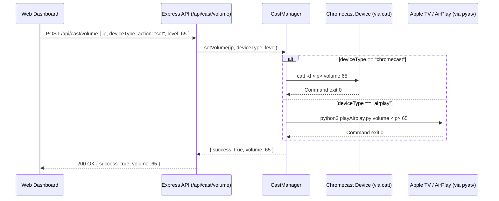

# Spec: Chromecast & AirPlay Volume Control

## Objective
Provide real-time volume management (level slider 0-100%, mute/unmute toggle, and incremental step up/down buttons) within the Live Cast web interface for active casting sessions across both Chromecast and AirPlay (Apple TV / smart TV) devices.

### User Stories
- **As a user casting to Chromecast**, I want to drag a volume slider, click mute, or press +/- buttons so I can adjust the playback loudness directly from the web dashboard without needing the physical TV remote.
- **As a user casting to AirPlay / Apple TV**, I want the volume controls to seamlessly relay volume adjustments to the connected Apple TV / AirPlay receiver.
- **As a user**, I want the volume controls to be enabled and responsive while an active cast session is running, and clearly disabled when the session is idle.
- **As a user**, I want visual feedback (percentage display, mute icon toggle, log entries) confirming that the device volume was changed.

---

## Tech Stack
- **Backend**: Node.js (Express), CommonJS modules
- **Frontend**: Vanilla HTML5, CSS3 (Glassmorphism dark theme), ES6 JavaScript
- **Chromecast Volume Engine**: `catt -d <ip> volume <0-100>`, `catt -d <ip> volumemute <true|false>`, `catt -d <ip> volumeup [step]`, `catt -d <ip> volumedown [step]`
- **AirPlay Volume Engine**: Python 3 (`services/playAirplay.py` utilizing `pyatv.interface.Audio`: `atv.audio.set_volume(level)`, `atv.audio.volume_up()`, `atv.audio.volume_down()`)
- **Icons**: Lucide Icons CDN (`volume`, `volume-1`, `volume-2`, `volume-x`, `plus`, `minus`)

---

## Architecture & Data Flow


```mermaid
sequenceDiagram
    participant UI as Web Dashboard
    participant API as Express API (/api/cast/volume)
    participant CM as CastManager
    participant Chromecast as Chromecast Device (via catt)
    participant AirPlay as Apple TV / AirPlay (via pyatv)

    UI->>API: POST /api/cast/volume { ip, deviceType, action: "set", level: 65 }
    API->>CM: setVolume(ip, deviceType, level)
    alt deviceType == "chromecast"
        CM->>Chromecast: catt -d <ip> volume 65
        Chromecast-->>CM: Command exit 0
    else deviceType == "airplay"
        CM->>AirPlay: python3 playAirplay.py volume <ip> 65
        AirPlay-->>CM: Command exit 0
    end
    CM-->>API: { success: true, volume: 65 }
    API-->>UI: 200 OK { success: true, volume: 65 }
```

### API Endpoints

#### `POST /api/cast/volume`
Adjusts or queries volume for an active session.

**Request Body:**
```json
{
  "action": "set" | "up" | "down" | "mute",
  "level": 65,         // required if action === "set" (0-100 integer)
  "step": 5,           // optional for "up" / "down" (default: 5)
  "isMuted": true      // required if action === "mute" (boolean)
}
```

**Response (Success - 200):**
```json
{
  "success": true,
  "action": "set",
  "level": 65,
  "isMuted": false
}
```

**Response (Error - 400/500):**
```json
{
  "success": false,
  "error": "Failed to set volume: device unreachable or command failed"
}
```

---

## Commands
```bash
# Start server
npm start

# Dev server with watch mode
npm run dev

# Chromecast volume adjustment verification (catt)
catt -d 192.168.1.50 volume 50
catt -d 192.168.1.50 volumeup 5
catt -d 192.168.1.50 volumedown 5

# AirPlay volume adjustment verification (playAirplay.py)
python3 services/playAirplay.py volume 192.168.1.60 50
python3 services/playAirplay.py volume_up 192.168.1.60
python3 services/playAirplay.py volume_down 192.168.1.60
```

---

## Project Structure
```
live_cast/
├── server.js              # Express route handler POST /api/cast/volume
├── services/
│   ├── castManager.js     # Orchestrates volume commands to catt / playAirplay.py
│   └── playAirplay.py     # Adds pyatv volume & volume_up/down handlers
├── public/
│   ├── index.html         # Volume slider, mute button, +/- step buttons in Session card
│   ├── css/style.css      # Volume control layout, slider styling, responsive tweaks
│   └── js/app.js          # Debounced volume slider events, mute toggle, +/- handlers
└── spec.md                # System specification
```

---

## Code Style & Implementation Details

- **Debouncing**: Volume slider input events MUST be debounced (150ms-250ms) to prevent flooding the network device with excessive CLI process spawns while dragging.
- **Optimistic UI with Fallback**: The UI immediately updates the percentage indicator and slider position, reverting or showing toast notification if the backend command errors.
- **Process Spawning**: Subprocesses (`catt` or `python3`) must have a hard timeout (5-7 seconds) so the UI thread doesn't hang if a device is slow to respond.
- **Module format**: CommonJS (`require`/`module.exports`) in Node backend, vanilla ES6 in frontend.

---

## Testing Strategy
1. **Unit & Validation Tests**:
   - Verify input validation on `/api/cast/volume` (level range 0-100, valid actions, reject invalid IPs or non-numeric values).
   - Test debouncer function behavior on rapid input events.
2. **Subprocess Execution**:
   - Test `python3 services/playAirplay.py volume <ip> <lvl>` execution path.
   - Test `catt -d <ip> volume <lvl>` execution path with mock or connected device.
3. **UI Integration**:
   - Controls are disabled and dimmed when state is `idle`.
   - Controls become active when state transitions to `casting`.
   - Slider drag, step buttons (+5 / -5), and mute toggle update server state and stream terminal logs.

---

## Boundaries
- **Always do**:
  - Bound volume values strictly between 0 and 100.
  - Set process execution timeouts (max 7s) to prevent orphan child processes.
  - Debounce slider dragging on the frontend.
  - Stream meaningful status logs to the on-screen terminal (`[Volume] Set to 60% on 192.168.1.50`).
- **Ask first**:
  - Installing any additional system-level binaries or changing default audio output routing.
- **Never do**:
  - Block the Express event loop with synchronous process execution (`execSync`) for volume calls.
  - Expose internal process crash traces or system credentials in the API responses.

---

## Success Criteria
- [ ] UI displays an integrated Volume Control widget in the Current Session section (Mute button, 0-100% Slider, - / + buttons, percentage label).
- [ ] Volume controls are disabled when casting is idle and enabled when casting is active.
- [ ] Changing volume on an active Chromecast executes `catt -d <ip> volume <lvl>` and updates audio.
- [ ] Changing volume on an active AirPlay device executes `playAirplay.py volume <ip> <lvl>` via `pyatv` and updates audio.
- [ ] Step up (+5%) and Step down (-5%) buttons work smoothly.
- [ ] Mute toggle saves prior volume level, sets volume to 0 (or invokes mute command), and restores previous level on unmute.
- [ ] Log messages appear in the dashboard terminal indicating volume actions.

---

## Open Questions & Fallbacks
1. **AirPlay TV Protocol Limitations**: Some AirPlay receivers (e.g. certain Samsung/LG TVs with AirPlay 2) disable programmatic master volume control over RTSP/MRP if external optical/eARC soundbars are attached. If `set_volume` throws `NotSupportedError`, `playAirplay.py` will gracefully attempt `volume_up`/`volume_down` key events as fallback, or log a descriptive hint in the terminal.
